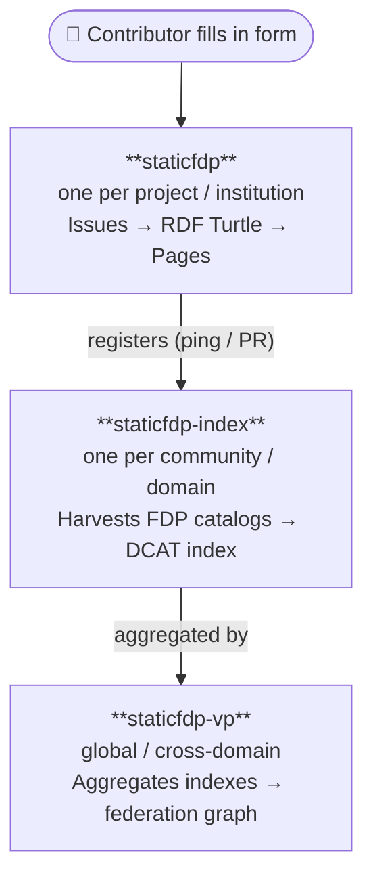

# StaticFDP Ecosystem

The StaticFDP ecosystem provides three open-source reference implementations
for the [FAIR Data Point](https://specs.fairdatapoint.org/) architecture — all
deployable on **static hosting** (GitHub Pages or Codeberg Pages) with no
dedicated server required.

---

## The three components

| Repository | Layer | What it does |
|---|---|---|
| **staticfdp** | FAIR Data Point | Publishes a DCAT-conformant FDP from form submissions via static hosting |
| **staticfdp-index** | FDP Index | Harvests registered FDPs and serves a discovery catalog as RDF + HTML |
| **staticfdp-vp** | Virtual Platform | Aggregates multiple FDP Indexes into a federated discovery hub |

Each repository is independently deployable and available on both platforms:

| | GitHub | Codeberg |
|---|---|---|
| staticfdp | [github.com/StaticFDP/staticfdp](https://github.com/StaticFDP/staticfdp) | [codeberg.org/StaticFDP/staticfdp](https://codeberg.org/StaticFDP/staticfdp) |
| staticfdp-index | [github.com/StaticFDP/staticfdp-index](https://github.com/StaticFDP/staticfdp-index) | [codeberg.org/StaticFDP/staticfdp-index](https://codeberg.org/StaticFDP/staticfdp-index) |
| staticfdp-vp | [github.com/StaticFDP/staticfdp-vp](https://github.com/StaticFDP/staticfdp-vp) | [codeberg.org/StaticFDP/staticfdp-vp](https://codeberg.org/StaticFDP/staticfdp-vp) |

---

## staticfdp — Static FAIR Data Point

> **This repository.** A template for publishing datasets as a FAIR Data Point
> using only static hosting.

**How it works:**

1. A contributor signs in with ORCID and fills in a web form
2. A Cloudflare Worker (or Deno on Hetzner) posts the submission to GitHub Issues / Forgejo Issues
3. GitHub Actions or Woodpecker CI runs `scripts/issues_to_datasets.py`, converting every Issue to RDF Turtle + JSON-LD
4. The generated files are committed to `docs/fdp/` and served as a DCAT-conformant FDP

**Key features:**
- ORCID authentication — no password management
- Dual-write to GitHub + Codeberg simultaneously (optional)
- `scripts/setup.sh` — interactive infrastructure configuration
- `fdp-config.yaml` — single source of truth (platform, URLs, publisher)
- GitHub Actions + Woodpecker CI pipelines included

**Quick start (GitHub):**
```bash
git clone https://github.com/StaticFDP/staticfdp
cd staticfdp
bash scripts/setup.sh
```

**Quick start (Codeberg):**
```bash
git clone https://codeberg.org/StaticFDP/staticfdp
cd staticfdp
bash scripts/setup.sh
```

---

## Architecture overview



---

## Infrastructure: GitHub, Codeberg, or both

Every component supports three deployment targets, configurable via `fdp-config.yaml`:

| Target | Platform | Jurisdiction | CI/CD |
|---|---|---|---|
| `github` | GitHub Pages | Microsoft, US | GitHub Actions |
| `codeberg` | Codeberg Pages (Hetzner Frankfurt) | German non-profit, EU | Woodpecker CI |
| `both` | Dual-write, active-active | US + EU | Both pipelines |

---

## Reference deployment

The **GA4GH Bring Your Own Disease** session (April 2026) is the first live
deployment of `staticfdp`. Source:
- GitHub: [StaticFDP/ga4gh-rare-disease-trajectories](https://github.com/StaticFDP/ga4gh-rare-disease-trajectories)

Live FDP: [fdp.semscape.org/ga4gh-rare-disease-trajectories/](https://fdp.semscape.org/ga4gh-rare-disease-trajectories/)

---

## Secrets required after setup

| Secret | Purpose | How to set |
|---|---|---|
| `GITHUB_TOKEN` | Post Issues to GitHub | `wrangler secret put GITHUB_TOKEN` |
| `FORGEJO_TOKEN` | Post Issues to Codeberg (optional) | `wrangler secret put FORGEJO_TOKEN` |
| `ORCID_CLIENT_ID` | ORCID OAuth | `wrangler secret put ORCID_CLIENT_ID` |
| `ORCID_CLIENT_SECRET` | ORCID OAuth | `wrangler secret put ORCID_CLIENT_SECRET` |
| `SESSION_SECRET` | HMAC-signed cookies | `wrangler secret put SESSION_SECRET` |

---

## License

MIT. See [LICENSE](LICENSE).
